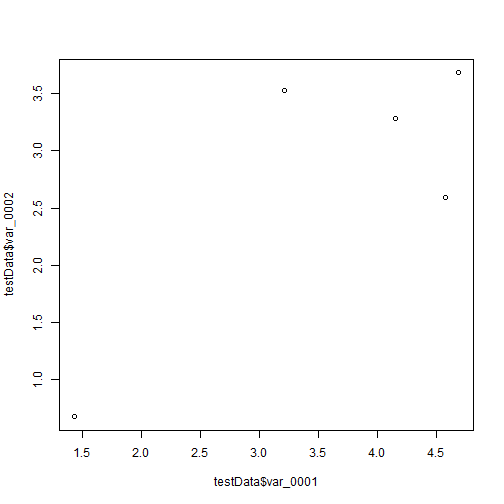

In this post we test the Rmd to github pages workflow.

# First markdown document

This is the first markdown test with github pages and jekyll.


```r
library (data.table)

set.seed(42)

testData <- data.table(matrix(runif(10, 0, 5), 5, 2))
names(testData) <- c("var_0001", "var_0002")

testData
```

```
##    var_0001 var_0002
## 1: 4.574030 2.595480
## 2: 4.685377 3.682942
## 3: 1.430698 0.673333
## 4: 4.152238 3.284961
## 5: 3.208728 3.525324
```
And features some fancy plots



# External Code Snippet


```r
randomData <- as.data.table(matrix(runif(numObjects*numRelevantDim), numObjects, numRelevantDim))

counter <- 1
subspaces <- vector(mode="list")

while(counter <= numRelevantDim - 2*minSubspaceSize ) {
  tmp <- ceiling(runif(1, minSubspaceSize - 2, min(maxSubspaceSize, numRelevantDim - counter - minSubspaceSize) -1))
  subspaces[[length(subspaces)+1]] <- c(counter:(counter+tmp))
  counter <- counter + tmp + 1
}
```

